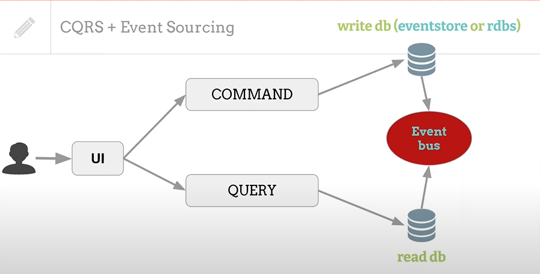
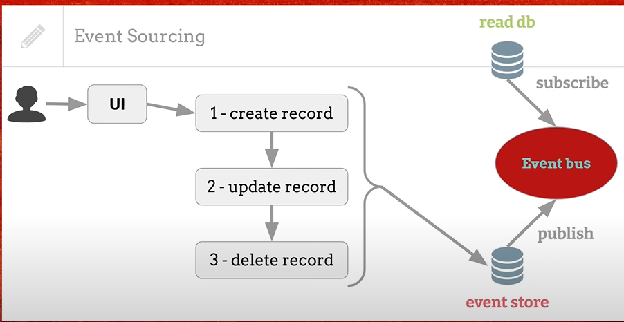

## Notas
## Command and Query Responsibility Segregation
La implementación de CQRS en su aplicación puede maximizar su rendimiento, escalabilidad y seguridad. La flexibilidad creada al migrar a CQRS permite que un sistema evolucione mejor con el tiempo y evita que los comandos de actualización causen conflictos de fusión a nivel de dominio.


# Menu:
 - [commands](#commands) 
 - [query](#query) 
 - [responsibility](#responsibility)
 - [segregation](#segregation)


# Complementos:
 
 - [command-handler](#command-handler)
 - [event-driven-arquitecture](#event-driven-arquitecture)
 - [event-sourcing](#event-sourcing)

## commands
[⬆️](#commands)
Son acciones muy concretas relacionadas con la creacion o modificacion de datos
Ejemplos:
```
> complate order
> update product price
> add product to the card
```

## query
[⬆️](#query)
Son las consultas que nunca modifican la base de datos los datos devuelte (json) 

## command-handler
[⬆️](#command-handler)
Para manejar lo logica de negocios se utiliza un manejador de comandos 
*Command Handler*

## event-driven-arquitecture
[⬆️](#event-driven-arquitecture) 

Para mantener la base de datos sincronizadas se realizar  a travez de rabbitmq, Apache Kafka.


## event-sourcing
[⬆️](#event-sourcing)

Se usa una base de datos llamada **Event Store**
se convierte en la fuente de verdad de los datos 

