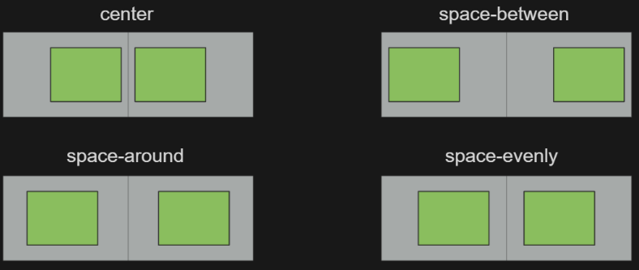
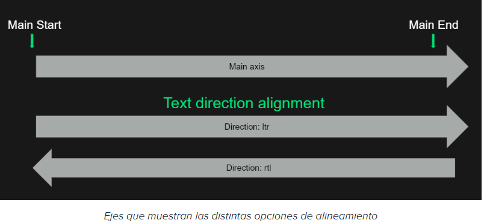
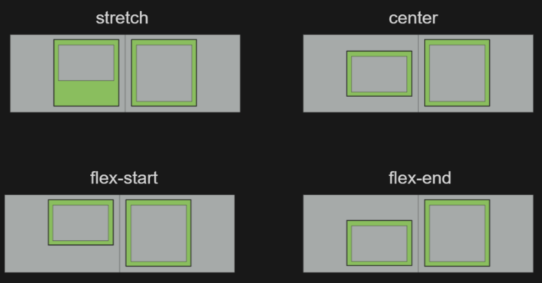

## Notas

- _Los flex se pueden anidar los hijos de un contenedor flex pueden tambien ser ***display: flex***_
## flexbox
# Menu:
 - [flex-direction](#flex-direction) 
 - [min-width](#min-width) 
 - [flex-wrap](#flex-wrap)
 - [align-content](#align-content)
 - [justify-content](#justify-content)
 - [Ajustar el contenido de los flex items](#align-items-align-self)
 - [Establecer el orden del contenido](#order)
 - [Crear elementos flexibles grow shrink](#flex-grow-flex-shrink)
 - [Establecer el tamaño base de nuestros flex-items: flex-basis](#flex-items-flex-basis)
 - [Combinar flex-basis y flex-wrap](#flex-basis-flex-wrap)
 - [alineamiento de justify-content](#justify)
 - [alinamiento align-items](#align-items)
 - [Layout responsive sin media queries usando flex](#responsive)

# Tips:
 - [Repartir tamaño igual de los item : flex](#flex) 


## flex-direction
[⬆️](#flexbox)
Por defecto, el valor de esta propiedad está establecido como row, que nos indica que el main axis irá en horizontal y de izquierda a derecha. Como contraposición, es importante conocer que el cross axis siempre será el eje perpendicular al definido anterior por lo que por defecto podemos decir que este eje irá en vertical y de arriba a abajo.
A parte del valor row, es posible orientar el main axis en vertical usando el valor column.


Por último, también es posible aplicar el valor reverse a ambas opciones, sin embargo hay que tener cuidado con esto ya que modificaría el orden visual pero no la estructura de nuestro HTML. Debido a esto, si es importante el orden en el que aparecen los elementos a nivel de lectura deberíamos evitar esta técnica ya que nos dará problemas de accesibilidad al acceder a la web con un lector de pantallas.
```
.container {
 	display: flex;
 	flex-direction: column | row | reverse;
}
```

## min-width
[⬆️](#flexbox)
`La propiedad min-width se usa para determinar la anchura mínima de un elemento. Previene que la propiedad width pueda ser inferior que min-width`

## flex-wrap
[⬆️](#flexbox)
si queremos que el contenido salte a la línea siguiente cuando no haya suficiente espacio disponible, podemos establecer el valor wrap que permite al contenedor crear múltiples líneas.
Por otro lado, cuando el main axis de nuestro contenedor es column debemos de tener en cuenta que la web crece en vertical de forma indefinida por lo que si no establecemos una altura fija a nuestro contenedor no veremos este comportamiento de wrapeo de columnas.


Y finalmente, al igual que la propiedad flex-direction, es posible establecer una valor de wrap-reverse. Aunque ya hemos visto que hay que tener cuidado con estras propiedades ya que podemos caer en grande problemas de accesibilidad.

```
.container {
	display: flex;
	gap: 1rem;
	flex-direction: row;
	flex-wrap: wrap;
}
```

## align-content
[⬆️](#flexbox) 

Esta propiedad nos permite repartir el espacio sobrante en el cross axis, es decir, el eje perpendicular al main axis.


Debido a esto, esta propiedad sólo funciona en caso de que el contenedor tenga activado el wrap y exista más de una fila, ya que si no existe más de una fila no habrá ningún espacio que repartir.


Al igual que la propiedad anterior, gracias a align-content podremos ajustar cómo queremos que se distribuya la posición de los items dentro del contenedor flexible y ajustarlos al espacio disponible.
Establecer el espacio entre las filas: align-content y justify-content

## justify-content
[⬆️](#flexbox)

Con esta propiedad podemos establecer cómo se reparte el contenido sobrante en el main axis. Jugando con sus valores podemos ajustar nuestro contenido para que el espacio sobrante siempre se reparta con gran precisión de la forma que le indiquemos.


En el vídeo vemos cómo es fácil centrar el contenido o repartirlo a partes iguales entre los distintos elementos de la fila. Si quieres profundizar en detalle en cada uno de sus posibles valores puedes consultar esta web.


Es importante indicar que esta propiedad se aplicará a cada una de las filas que se generen por lo que si una fila tiene menos elementos que la anterior el espacio se repartirá de forma distinta.

## align-items-align-self  
[⬆️](#flexbox)

aling-items

Al igual que podemos establecer cómo se reparte el contenido sobrante entre ambos ejes, es posible ajustar cómo se reparte el contenido de cada uno de los items.


Como hemos visto, por defecto, cada uno de los items tiene el mismo tamaño en el cross axis. Esto es debido a que por defecto el contenedor flex tiene la propiedad aling-items: strech, que iguala el tamaño de cada uno de los items en el cross axis con el de mayor tamaño.


Además, es posible establecer otros valores que nos permitirán centrar o alinear nuestro contenido a los bordes del eje.


align-self

Mientras que align-items se aplica al contenedor flex, afectando por igual a todos los items del contenedor, es posible sobreescribir el valor de esta propiedad para un item en particular usando la propiedad align-self.

## order
[⬆️](#flexbox)
```
  .item:nth-child(2) {
    order: -1|1;
  }
```

La especificación de flex también nos permite personalizar la forma en la que el contenido se representa a nivel de flex item.


Una de las propiedades que nos permite personalizar esto es la propiedad order.


Esta propiedad establece un índice a partir del cual los items son ordenados en el eje. Por defecto cada uno de los items presenta un valor de 0, por lo que podemos aplicar valores negativos si queremos que los elementos aparezcan primero y valores positivos si queremos que los elementos aparezcan más tarde.


Mediante esta propiedad sólo modificamos el orden visual, dejando intacta la estructura de nuestro DOM, por lo que es importante sólo aplicarla en casos que el orden de lectura no sea importante o en casos en los que el orden de lectura permanezca inalterado aunque visualmente se haya modificado cómo aparecen los elementos.

## #flex-grow-flex-shrink
[⬆️](#flexbox)
flex-shrink

Esta propiedad establece un factor de decrecimiento a los items del flex container. Esto provocará que los items reduzcan su tamaño en el main axis cuando el espacio disponible sea menor que el espacio que necesitan.


Al ser un número proporcional, el espacio se resta de los items en función de su valor. Por lo que a un item con un valor de 2 se le restará el doble de espacio que a un item con un valor de 1.


En la siguiente imagen podemos ver que el elemento con el flex-shrink de 2 reduce su tamaño el doble que el elemento con flex-shrink de 1.
El valor por defecto de esta prop es 1 por lo que cuando creemos un nuevo contenedor flex si no especificamos nada los items reduciran su tamaño por defecto para no salirse del contenedor.


flex-grow

Esta propiedad establece un factor de crecimiento para los items. Su comportamiento es igual al de flex-shrink pero repartiendo el espacio sobrante en el main axis después de colocar los flex items.


Como hemos visto, el espacio se repartirá de forma proporcional en función del valor de esta propiedad.

Por defecto, esta propiedad tiene un valor de 0 por lo que los items no crecerán con el espacio disponible a no ser que lo especifiquemos.


flex

También es posible establecer estos valores usando el shorthand flex. Con esta regla podemos establecer flex-grow, flex-shrink y flex-basis (de esta propiedad hablamos en el siguiente vídeo), siendo opcionales el segundo y el tercer parámetro.


`flex: [ <'flex-grow'> <'flex-shrink'>? <'flex-basis'>? ]`

Es recomendable usar esta propiedad en lugar de establecer los valores por separado ya que al usar este shorthand, los valores que omitimos adquieren valores por defecto que cubren los típicos casos de uso.


Por ejemplo, al establecer flex: 1, flex-shrink adquiere el valor de 1 y flex-basis el valor de 0%. Que en la práctica resulta con repartir el espacio de todos los items a partes iguales.

## flex-items-flex-basis
[⬆️](#flexbox)
***Establecer el tamaño base de nuestros flex-items: flex-basis***

```
 .card {
 	flex: 1 1 0%;
 }
```

Esta propiedad sirve para establecer el tamaño base del elemento en el main axis antes de sumar o restar espacio y admite valores numéricos o porcentajes.

Es importante tener en cuenta que aunque parezca que esta regla coincide con establecer el width de un elemento, esto sólo ocurrirá en los casos en los que el flex-direction sea row, ya que si el main axis es el eje vertical este valor coincidirá con la altura de los elementos.

Es por esto que es recomendable usar esta propiedad cuando queramos dar un tamaño base a los elementos de un flex container en lugar de usar el width o el height.

Por último, como ya hemos visto antes, es posible establecer el flex-basis mediante el shorthand flex. Coincidiendo con el tercer valor del shorthand y teniendo un valor por defecto de 0% al usar este shorthand.

## flex-basis-flex-wrap
[⬆️](#flexbox)

La propiedad flex-basis indica el tamaño base a partir del que los flex items crecerán o disminuiran en función de su configuración.


Si el contenedor no está configurado para hacer wrap de los items no veremos ningún comportamiento especial, pero si activamos esta propiedad el contenedor creará una nueva fila cada vez que no tenga espacio disponible para los items según el tamaño que les hayamos establecido.

## justify
[⬆️](#flexbox)



A parte de los valores propios de flex también es posible emplear los valores de start y end.


Estos valores en lugar de alinearse con el main start y el main end se alinearán con la dirección de escritura de nuestro documento por lo que cómo vemos en el vídeo es posible que tengamos situaciones en las que no coincidan ambos orígenes y tengamos comportamientos no esperados.

```
.container {
	display: flex;
	gap: 1rem:
	justify-content: flex-start;
	direcction: rtl|ltf;
}
```


## align-items
[⬆️](#flexbox)


A parte de los valores anteriores, es posible también indicar los valores de start y end que harán que nuestros items sigan el eje de la dirección de escritura en lugar de cross start y el cross end.


Finalmente también vemos los valores de self-start y self-end que harán que el item siga su propia dirección de escritura y no la indicada en el contendor flex.


```
.container {
	display: flex;
	aling-items: center|stretch|flex-start|flex-end
}
```
Tambien podemos alienar un items  especifico a con la propiedad _align-self_
> align-self: self-start|self-end;
```
.card::nth-child(1) {
	align-self: self-start;
}
```

## responsive
[⬆️](#flexbox)
***Layout responsive sin media queries usando flex***
[Ejemplo en github](https://github.com/CodelyTV/css-flex-course/tree/main/43-responsive-layout)
```
.container {
  display: flex;
  flex-wrap: wrap;
  gap: 1rem;

  .menu {
    flex-basis: 20rem;
    flex-grow: 1;
  }

  .gallery {
    flex-basis: 0;
    flex-grow: 999;
    min-width: 60%;
  }
}
```

El truco de este layout parte de indicar al contenido que queremos que coja todo el espacio disponible, que no use el menú, con la combinación de la propiedad flex-basis: 0 y flex-grow: 999.


Además, cuando el espacio disponible sea menor al 60% del contenedor el contenido se moverá a una nueva fila por lo que obtenemos el efecto del layout responsive que se ajusta cuando hay poco espacio disponible.


Finalmente hacemos unos ajustes al menú para que también se adapte mejor a todos los tamaños de pantalla y así obtener un layout más flexible.
```
menu {
  ul {
    display: flex;
    flex-wrap: wrap;
    gap: .5rem;

    li {
      flex-grow: 1;
      flex-basis: 20rem;
    }
  }
}
```

## flex
[⬆️](#flexbox)
> flex: 1;